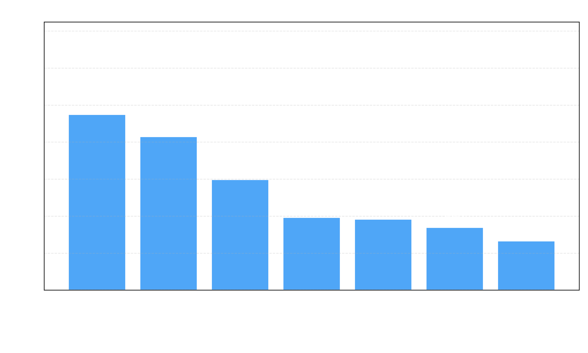

# 🌤️ Weather Prediction with METAR + LSTM
This project focuses on enhancing **short-term weather forecasting** at airfields using **METAR (Meteorological Aerodrome Reports)** and **Long Short-Term Memory (LSTM)** neural networks.

Accurate forecasting is crucial for flight safety, especially for student pilots, whose training heavily depends on **calm and clear weather conditions.** Using structured hourly METAR reports, this project builds a data-driven machine learning pipeline to predict:

- Surface wind direction and speed
- Visibility
- Temperature and dew point
- Atmospheric pressure

&nbsp;

## 📂 Project Folder Structure


```
demo/
├── metar_raw/
│   └── raw_metar.csv            # Your input METAR data
├── metar_processed/             # Stores parsed & scaled data
├── input_splits/                # Train/val/test data splits
└── model_weights/               # Saved model and scaler
```

&nbsp;

## 🚀 Quick Start

**1. Set up Environment**
```bash 
pip install -r requirements.txt
```

&nbsp;

**2. Prepare Input Data**

Place your METAR data as "raw_metar.csv" inside:
```
demo/metar_raw/raw_metar.csv
```

The file should contain at least these columns:
- valid: Timestamp of report
- metar: Raw METAR string

&nbsp;

**3. Run the Full Pipeline**
```bash 
bash Train.sh
```

This script will:

1. Parse raw METAR reports -> structured CSV
2. Scale (normalize) and encode data
3. Create sequences for LSTM input/output
4. Train the LSTM model
5. Evaluate the model on the test set

&nbsp;

## 📊 Model Details
- Architecture: 2-layer LSTM (128 + 64 units) + Dense output

- Input: Past 168 hours of METAR-derived weather data

- Output: 12-hour prediction for:
    - Wind direction (as sin/cos)
    - Wind speed
    - Visibility
    - Temperature
    - Dew point
    - Pressure
    - Wind direction variability

&nbsp;

## 🖼️ Results
The following chart shows the normalized mean absolute error (MAE) of the model's predictions, scaled to the [0, 1] range for easier comparison across variables. Wind direction is shown as a fraction of 360°.



| Feature         | Normalized MAE |
|----------------|----------------|
| Wind Direction | 0.0383         |
| Wind Var       | 0.0949         |
| Wind Speed     | 0.0597         |
| Visibility     | 0.0829         |
| Temperature    | 0.0338         |
| Dew Point      | 0.0392         |
| Pressure       | 0.0265         |


&nbsp;

## 📬 Contact
Questions or suggestions? Feel free to open an issue or contribute via pull request.